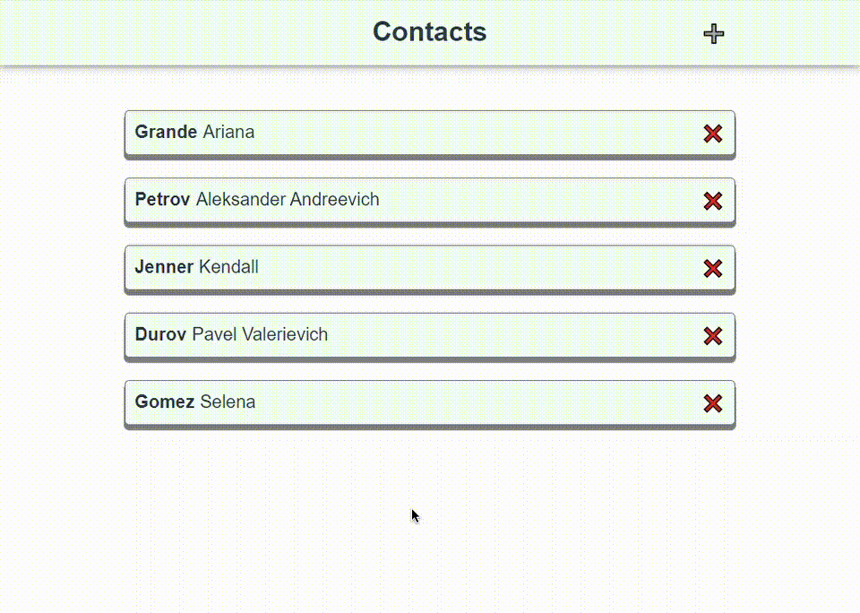
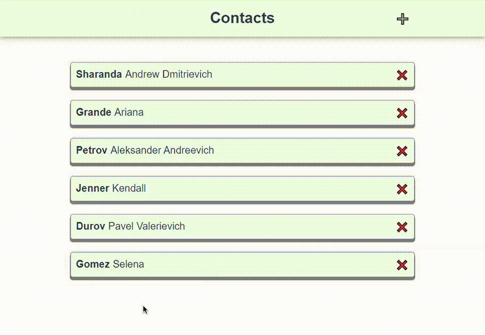
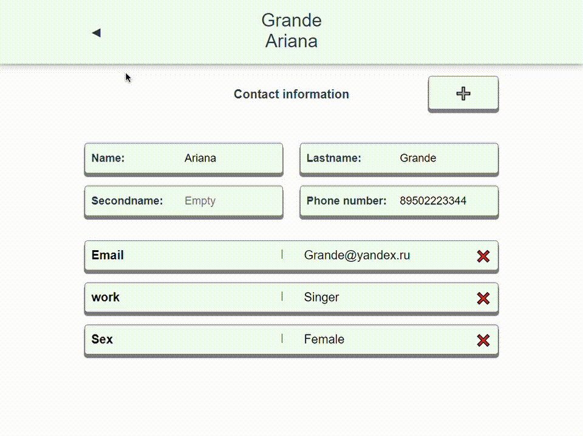
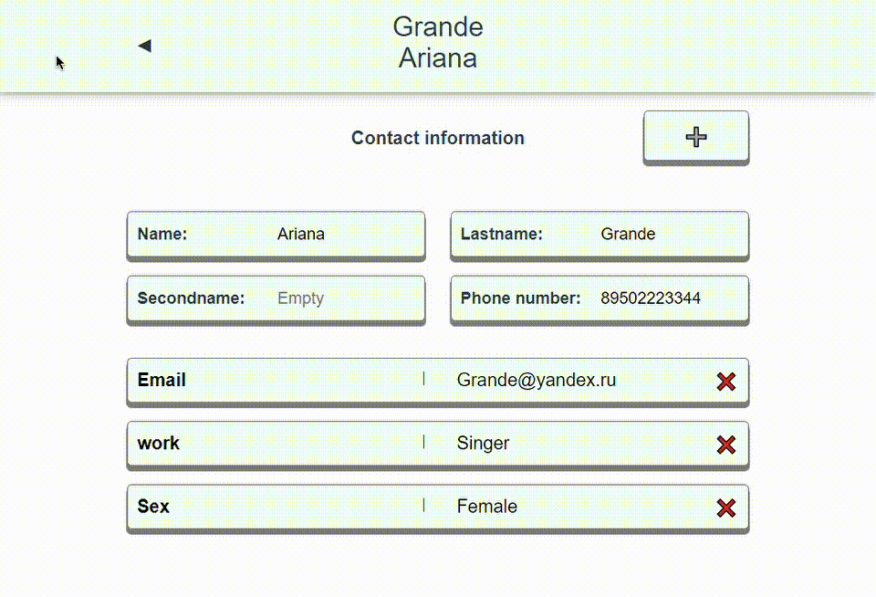
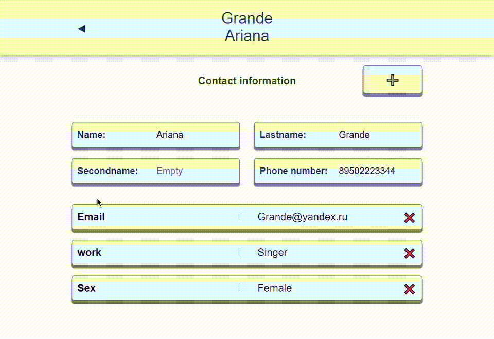
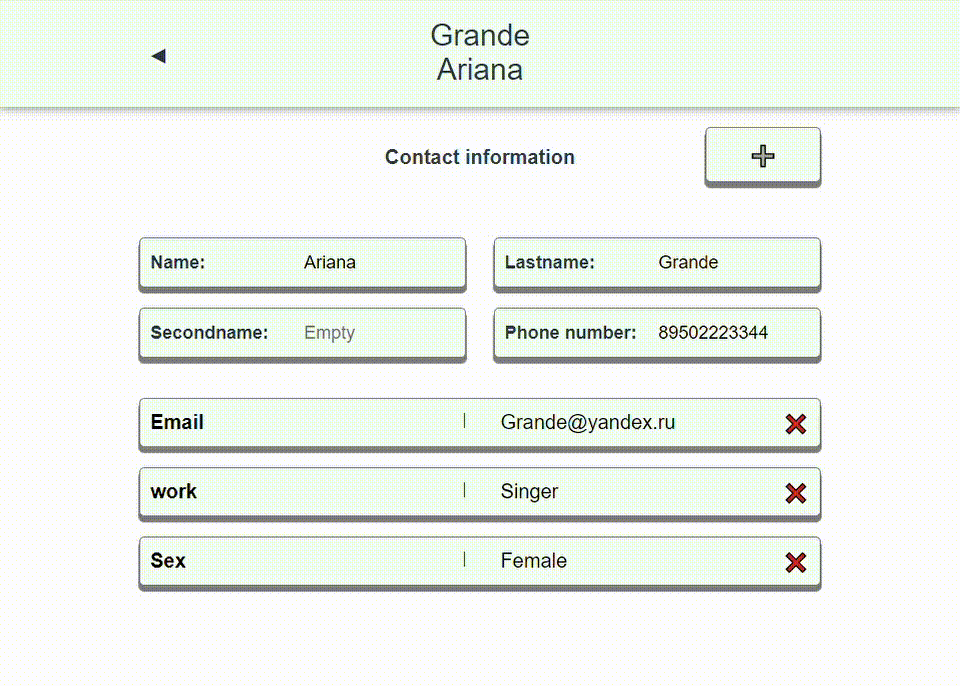

# SPA-Contacts (vue)

SPA application - Book of contacts, implemented by means of Vue.js.<br/>
Test the functionality [here](https://azzimandias.github.io/vue-spa-contacts/).

---

## Project setup
```
npm install
```

### Compiles and hot-reloads for development
```
npm run serve
```

### Compiles and minifies for production
```
npm run build
```

### Lints and fixes files
```
npm run lint
```

### Customize configuration
See [Configuration Reference](https://cli.vuejs.org/config/).


---

## Project description

This app has two pages:

1. Contact list
2. Contact Information

---

### On the first page you can:

- Add new contact;<br/>
  
- Remove contacts;<br/>
  
- Select contacts and go to the second page;

### On the second page you can:

- Add a new field;<br/>
  
- Remove fields;<br/>
  
- Undo all changes;<br/>
  
- Undo the last change made "Step back";<br/>
  
- Edit fields;  
- Leave the page with saving all changes;
